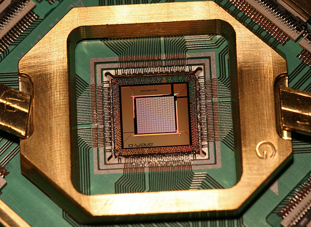

# QUBO

## Definition
QUBO stands for Quadratic Unconstrained Binary Optimization. 

So every QUBO model has the following characteristics:
- Its objective function is at most quadratic
- There are no constraints
- All variables are binary (0 or 1)

We can represent a QUBO as follows.

```math
\begin{array}{rl}
   \min        & \mathbf{x}' Q\,\mathbf{x} \\
   \text{s.t.} & \mathbf{x} \in \mathbb{B}^{n}
\end{array}
```

## OK, but why QUBO?


QUBOs are suited for representing non-convex global optimization problems. With that said, the significant advances in computing systems and algorithms specialized for sampling QUBOs has been contributing to their popularity.

Some of the paradigms that stand out for running QUBOs are quantum gate-based optimization algorithms (QAOA and VQE), quantum annealers, hardware-accelerated platforms (Coherent Ising Machines and Simulated Bifurcation Machines).



```@docs
ToQUBO.isqubo
ToQUBO.toqubo
ToQUBO.toqubo!
```
